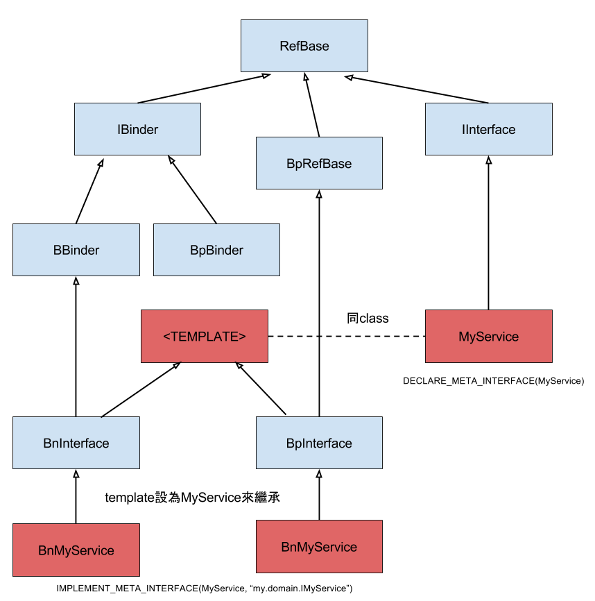

Android framework本身提供一系列的系統服務，並提供Java/C++的API來呼叫這些服務。這提供給Android App開發者一個很大的方便：只要
使用這些API就可以直接調用系統的功能，App開發者甚至不用自己準備能調用這些API的環境。

舉例來說，如果你想播放音效，只要使用Audio系列的API就可以了，而實際處理音訊檔到驅動硬體播出的部份則是由系統服務中的`AudioFlinger`來處理，不需要讓App開發者自己處理。

諸如6軸感硬器、照相機、閃光燈、震動裝置、網路連線等等的功能，如果要讓每個App開發者自己處理也太辛苦了。而且有些功能系統不願意提供太多權限給App開發者修改。這些功能適合由系統處理，但同時提供適當的API，讓開發者也能使用部份的功能。

為了達成這個目的，Android將系統服務放在由系統控制的許多Process內，再提供一套IPC(Inter Processes Communication)框架來讓其它程式可以呼叫系統服務。Android本身的系統服務也會利用這套IPC來互相呼叫。比如說，負責播打電話的系統服務也會用到震動和喇叭的系統服務，也是透過同樣的IPC框架來實現。

在Android內這個IPC框架主要由`Binder`構成。寫過像是bound Service或者用過AIDL的App開發者對這個詞應該不莫生。接下來就讓我們來看看這個`Binder`到底是怎麼實現的吧。

# Kernel Binder Driver

檔案位置：

* `KERNEL_ROOT/include/uapi/linux/android/binder.h`
* `KERNEL_ROOT/drivers/android/binder.c`

Binder Driver負責在IPC過程中能夠找到目標process。利用`ioctl`並代入一個`cmd`(command)參數的方試來操作Binder Driver。像是加入一個Binder節點或者是取得特定編號的Binder，都是在這裡實作。

## Context Manager

由於Android系統中允許切換不同的系統實作，也允許廠商及App開發者登錄自己的系統服務(像是允許用Intent開啟別的App)，但我們總要有個方法找到目標Process吧？這就是由`Context Manager`負責。

系統中有一個負責管理Binder的process，在開機過程中會在Binder Driver中將自己設定為`Context Manager`。這個Process中會記錄一張表，其中記錄了所有Process在Binder Driver中的`binder_node`編號(在程式碼中為叫做`handle`，是一個u32的值)。如果Target編號是0，則會回傳Context Manager本身。

大致上找到目標Process的方式是：先設目標handle為0，先找到Context Manager。接著送給Context Manager一個名稱，Context Manager會回答你這個名稱的對應編號是多少。接著再利用這個編號問Binder Driver，Binder Driver就會告訴你目標編號，再來就可以把資料寫進該編號的Process內，實現IPC。

Kernel中實現IPC是是用shared memory來使資料共用，這部份在實作上比較複雜，且比較偏向Kernel的範疇，因此這邊不討論太多。如果想要深入了解Binder Driver，在對岸有很多分析文，像是[這篇](/http://gityuan.com/2015/11/01/binder-driver/)就很值得參考。

# Native (c++) 層的Binder

這邊有幾個重要的東西：

* 和Binder Driver溝通所需要的程式：servicemanager
* `IBinder`類別：所有走Binder機制進行IPC的類別在過程中都會短暫的變成IBinder，在真的要使用時會再用IBinder.asInterface()來轉換回原本的介面。
* `JavaBBinder`：由C++層提供給Java層用的Binder介面

## servicemanager

在`Context Manager`中提到，有個程式會變成`Context Manager`，這個程式位在`$TOP/frameworks/native/cmds/servicemanager/`中。可以在同資料夾的`service_manager.c`下找到`main()`，藉由呼叫`ioctl(bs->fd, BINDER_SET_CONTEXT_MGR, 0);`來設定自己為`Context Manager`後，會進入一個無窮迴圈等待別的Process交辦事項。

### service 工具

同樣在`$TOP/frameworks/native/cmds/`資料夾下還有一個叫`service`的資料夾，這個`service`資料夾內放了一個很單純的C程式，可以在`adb shell`內把被註冊進`servicemanager`內的所有Binder給叫出來。

## IBinder相關的標頭檔

在`$TOP/frameworks/native/include/binder/`下可以找到很多和Binder相關的C++ header file，包含：

* `IInterface`：要能透過Binder IPC呼叫的C++ class都必需繼承此類別。
* `IBinder.h`、`Binder.h`、`BpBinder.h`：IPC過程中變成IBinder所需要的實作
* `Parcel.h`：真的用來寫入shared memory用的程式。用來將支援的型別以正確的方式寫進shared memory。
* `IServiceManager.h`：用來拿系統當前的`ServiceManager`的程式碼。

繼承圖：

圖中紅色為必需自己宣告及實作的部份

### IBinder、BBinder、BpBinder

利用transaction來處理資料。每次transaction時會代入適當的`cmd`參數，所以就知道這次是打算呼叫哪個函式。如果實作上是`BBinder`就會直接呼叫，如果是`BpBinder`就會利用`Parcel`來將資料送到另一個Process再呼叫對應的函式。

`BBinder`意思是這個Binder和當前Process是同一個Process，所以不需要多此一舉做IPC。而如果是BpBinder指的則是`Proxy`--這是一個連接其它Process用的工具，只要對它呼叫函式就會自動處理IPC。

### Parcel

<TODO>

### IServiceManager

IServiceManager界面提供用名稱取得目標服務及註冊新服務的功能。
`IServiceManager`由於本身也是系統服務的一部份，所以也是繼承自`IInterface`並實作了`BnServiceManager`和`BpServiceManager`。當中以提供了`sp<IServiceManager> defaultServiceManager()`讓任何類別都能拿到`IServiceManager`的實作。

`IServiceManager`提供的功能如下：

* `sp<IBinder> getService(const String16& name)`
* `sp<IBinder> checkService(const String16& name)`
* `status_t addService(const String16& name, const sp<IBinder>& service, bool allowIsolated = false)`

#### ProcessState::self()

值得注意的是`defaultServiceManager()`的實作會用到`ProcessState::self()->getContextObject(0)`，這一步是用來取得`servicemanager`用的。`ProcessState`是Android中用來放Process本身全域變數的地方。和它容易搞混的還有`IPCThreadState`，不過`IPCThreadState`是用來放Thread變數的地方，比如說像main thread要進入loop的狀態就會用`IPCThreadState::self()->joinThreadPool()`來做。

## 給Java層用的Binder：JavaBBinder

程式碼位在`$TOP/framework/base/core/jni/android_util.Binder.cpp`，可以發現`JavaBBinder`繼承了`BBinder`，目的是使C++層能夠呼叫Java層的Binder。換句話說，***Java層的Binder其實是用來給C++呼叫的，而非讓Java層彼此呼叫。***

# Java 層的Binder

* IBinder.java
* Binder.java
* AIDL

# 實作自己的C++ Interface

利用`DELCARE_META_INTERFACE`及`IMPLEMENT_META_INTERFACE`

# 參考資料

* [Gityuan的blog：Binder系列](http://gityuan.com/tags/#binder)
