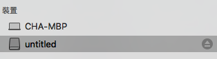
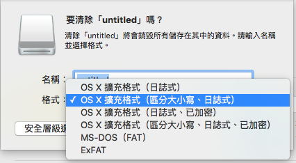
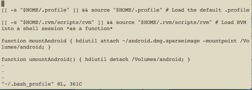

# 環境設定

歡迎來學習並開發 AOSP！本章節將教導大家如何在 Mac OS X 和 Ubuntu 14.04 LTS 上設定好你的 AOSP 開發環境。

請依據您的作業系統前往操作指導：[Mac OS X](#macosx)、[Ubuntu 14.04 LTS](#ubuntu1404)

# <a name="macosx">Mac OS X</a>
## 準備好開發 AOSP 要用的磁區

一個不好的消息是，如果要開發 AOSP 你最少要準備約 100 GB 的磁碟空間。如果你的Mac是總容量較小的型號，那要準備出這個空間可不容易呀！不過沒關係，這部份你可以準備一張 128 GB 的高速 SD 卡來代替！（如果你用的是外接硬碟，則設定同 SD 卡。不過 USB 的傳輸速度很慢，所以還是建議用 SD 卡）

以下有兩個準備空間的選項，請依照你的需求選擇其一即可

1. [分割 AOSP 磁區](#disk_option1)
2. [使用外接 128 GB（以上）的 SD 記憶卡](#disk_option2)

### <a name="disk_option1">選項 1 - 分割 AOSP 磁區</a>

AOSP 的檔案和編譯環境是有區分大小寫的（比如說，同檔名但大小寫不同會被視為不同的檔案）。而 Mac 上預設的檔案系統（File System）是不分大小寫的，所以我們要先切一塊磁區出來，並使用分大小寫的檔案系統。

```shell
$ hdiutil create -type SPARSE -fs 'Case-sensitive Journaled HFS+' -size 100g ~/android.dmg
```

官方文件是建議切 40 GB 出來，但最新（AOSP 上的 master branch）光下載 Source Code 就 38 GB 了……這邊建議是直接切個 100 GB 出來。不夠也不用擔心，這個之後還能調大。

接著會在你的家目錄（`$ ~/`）下找到剛建立出來的磁區 `android.img`。它也有可能被叫做 `android.img.sparseimage`，以下為了方便，我們統一把他命名成 `android.img.sparseimage`

```shell
$ mv ~/android.img ~/android.img.sparseimage   # 僅在你建出來的磁區叫做 android.img 時才需做這個步驟
```

如果之後需要修改這個磁區的大小（通常是要改大），可以使用以下指令：

```shell
$ hdiutil resize -size <new-size-you-want>g ~/android.dmg.sparseimage
```

#### 建立 mountAndroid 及 umountAndroid 指令

由於切出來的這個磁區有點像是在電腦內切出一個 USB 磁碟，所以這個 USB 是需要掛載（`mount` 指令）後才能用的。當然可以掛載就可以卸載（`umount` 指令）。而因為這兩個指令其實不是很好背，所以我們來為我們的 CLI 建立兩個方便掛載和卸載 Android 磁區的指令

打開 `~/.bash_profile`，加入以下兩段內容：

* 指令 1: mountAndroid

```shell
# mount the android file image
function mountAndroid { hdiutil attach ~/android.dmg.sparseimage -mountpoint /Volumes/android; }
```

* 指令 2: umountAndroid

```shell
# unmount the android file image
function umountAndroid() { hdiutil detach /Volumes/android; }
```

完成後，重開你的 Terminal，便可以使用 mountAndroid 及 umountAndroid 了指令了。

`mountAndroid` 指令會將 Android 磁區掛載到 `/Volumes/android` 的位置，相對的 `umountAndroid` 就是卸載嘍

當然啦，因為這個磁區就像是掛載上電腦的一樣，所以你也可以打開 Finder 手動退出它



### <a name="disk_option2"> 選項 2 - [使用外接 128G（以上）的 SD 記憶卡] </a>

由於 AOSP 所需要的是區分大小寫的磁區，所以我們要將 SD 記憶卡給格式化成我們需要的格式。

請依下列步驟

1. 插上 SD 記憶卡
2. 請確定記憶卡內沒有任何需要的資料，過程中記憶卡的資料將*永久*消失
3. 打開你電腦中的**`磁碟工具程式`**
4. 選擇SD記憶卡後，按下**`清除`**標籤
5. 名稱隨意取一個，但保險起見不要有空格
6. 格式請選擇**`OS X 擴充格式 (區分大小寫、日誌式)`**
7. 按下**`清除`**按鈕
8. 完成！



## 安裝需要的 Libraries 和 Packages

請參考[官網](https://source.android.com/source/requirements.html)，一般來說 Android App 開發者該裝的都裝過了。

雖然官網上的教學用的是 MacPort，但我本身覺得 homebrew 比較好用而不喜歡 MacPort，所以我是安裝 [homebrew](http://brew.sh/)

```shell
$ brew install gnupg   # 安裝 gnupg
```

Mac 上應該已經內建 `git`1.7+（可用 `git --version` 查尋）及 `python` 2.7.+（可用 `python --version` 查）。注意 Python 3.x 是不行的，非 2.7 不可。主要是因為 Python 3.x 不相容 Python 2.x，而在早期 AOSP 開發過程中，有很多的檔案和工具是用 Python 2.7 寫的，官方也沒有把這些檔案轉成 Python 3.x 的版本。通常來說電腦內輸入 `python` 會用 2.x，而輸入 `python3` 會用 3.x)

以下是官網沒提到，但實際上你需要安裝的 Libraries

```shell
$ brew install cmake   # 取代 gnu-make
$ brew install ninja   # ninja-build，Android 6.0 後期開始採用的新 build code 機制，用來取代 GNU make
$ brew install xz   # ninja-build 的過程會用到
```

`curl` 也必需安裝，但這邊有個特殊情況。Mac內建就有一個 curl，但用內建的在編譯過程會有問題，所以我們還是必需自己裝一份。而這邊不能直接用 `brew install curl` 裝，因為 AOSP 需要的 `curl` 必需是用 `openssl` 來編譯，但預設 `brew install curl` 並不是用 `openssl` 這個 Library 來編，所以這邊在安裝時要用：

```
$ brew install curl --with-openssl   # 先裝起來，下一章會再處理選用自己裝的 curl 這件事。
```

## 調高 FD 上限

Mac 預設上有限制最大 FD 開啟數量(簡單來說，Mac 有限制同時間開啟的檔案數量)，而這個數量不夠我們編譯 AOSP。因此我們必需調高它。

在 `~/.bash_profile` 內加入以下程式碼

```shell
# set the number of open files to be 1024
$ ulimit -S -n 1024
```

完成這步後請記得重新打開你的終端機，這樣改動才會生效。

<TODO 優化 Build 系統(原理是做 cache，但因為 Mac 容量有限所以我覺得別設比較好……)>

## 完成！

至此，基本環境設定就算完成了！接下來就是下載 AOSP 原始碼嘍！

[下一章：下載 AOSP 程式碼](/ch2_download)


# <a name="ubuntu1404">Ubuntu 14.04 LTS</a>
## 安裝需要的 Libraries 和 Packages

參考來源：[官網](https://source.android.com/source/requirements.html)。

```shell
$ sudo apt-get update
$ sudo apt-get install git-core gnupg flex bison gperf build-essential zip curl zlib1g-dev gcc-multilib g++-multilib libc6-dev-i386 lib32ncurses5-dev x11proto-core-dev libx11-dev lib32z-dev ccache libgl1-mesa-dev libxml2-utils xsltproc unzip openjdk-7-jdk
```

啟用 ccache 機制

```shell
$ vi ~/.bashrc
# 加入以下內容
export USE_CCACHE=1
```

## Reference

* [AOSP官方設定(英)](https://source.android.com/source/initializing.html)


# Mac 補充
* Mac OS 是 不區分大小寫的，所以會在 git 上產生異常，所以才需要特別建立一個使用分大小寫的檔案系統。
* 使用`外接 SD 記憶卡` 建議將記憶卡名稱命名為 `android.dmg.sparseimage`。
* 不管是 `分割 AOSP 磁區`或是 `使用外接 SD 記憶卡` 都需要做 `建立 mountAndroid 及 umountAndroid 指令`
* CLI (command-line interface) 命令行界面
* `~/`為使用者之家目錄 `.bash_profile` 為該目錄下之一個隱藏檔，故上方`~/.bash_profile` 是要我們在終端機上輸入  "vim ~/.bash_profile " 完成畫面應該會如下圖


