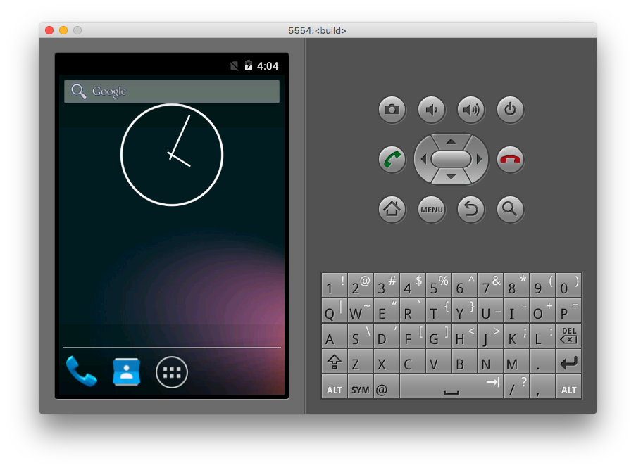
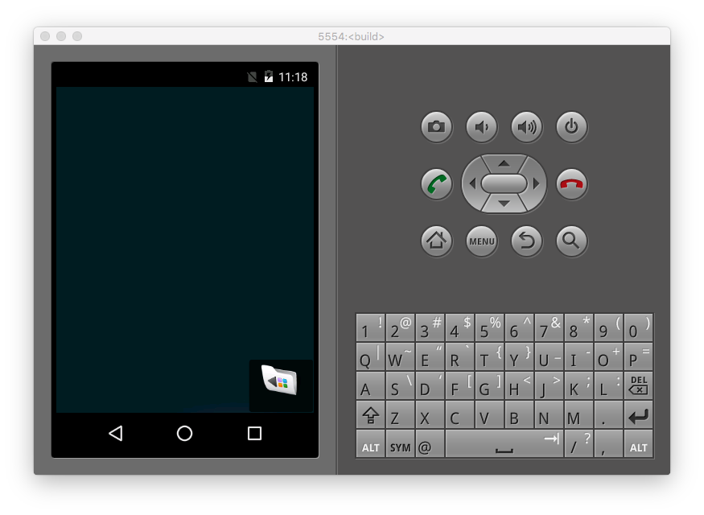

# 編譯 AOSP

[上一章：下載 AOSP 程式碼](/ch2_download)

請依據您的作業系統前往操作指導：[Mac OS X](#macosx)、[Ubuntu 14.04 LTS](#ubuntu1404)

這章節將正式編譯AOSP原始碼，並以你編好的 AOSP Image 打開模擬器。

# <a name="macosx">Mac OS X</a>
## 設定環境變數

如果你的環境是Mac，環境變數的設定中要額外設定兩個路徑：

1. `$ANDROID_JAVA_HOME` 要正確選到 Java 8 的版本
2. 要選我們用 homebrew 自己安裝的 `curl`，而不要用預設的 `curl`

再加上原本編譯 AOSP 就需要的 `source build/envsetup.sh` 也要做，這一個動作會將 AOSP 預設所有需要的環境變數設好，總體來說我們要做的就是：

```shell
$ export ANDROID_JAVA_HOME=$(/usr/libexec/java_home -v1.8)
$ source build/envsetup.sh
$ export PATH=$(brew --prefix curl)/bin:$PATH # Use newer curl
```

這樣就算完成環境變數的設定了。請注意這個設定會在你關掉終端機頁面後消失，如果開了新的終端機頁面就要重新設定。

***完成環境變數設定後，`$TOP` 會被設定成 AOSP 原始碼的根目錄。你可以用如 `cd $TOP` 的指令直接移動到 AOSP 原始碼根目錄。以下如果提到 `$TOP` 這個位置，則皆指 AOSP 原始碼根目錄。以目前為止的範例來說，Mac 上分割磁區者會是在 `/Volumes/android/aosp`，用外接 SD 記憶卡的則是在 `[SD卡根目錄]/aosp/`***

## 選擇要 build 的 image 類型

在已經設定好環境變數的 shell 內輸入

```
$ lunch
```

會跳出如下的選項

```
 /Volumes/android/aosp/ lunch

You're building on Darwin

Lunch menu... pick a combo:
     1. aosp_arm-eng
     2. aosp_arm64-eng
     3. aosp_mips-eng
     4. aosp_mips64-eng
     5. aosp_x86-eng
     6. aosp_x86_64-eng
     7. aosp_deb-userdebug
     8. aosp_flo-userdebug
     9. full_fugu-userdebug
     10. aosp_fugu-userdebug
     11. mini_emulator_arm64-userdebug
     12. m_e_arm-userdebug
     13. mini_emulator_mips-userdebug
     14. mini_emulator_x86-userdebug
     15. mini_emulator_x86_64-userdebug
     16. aosp_flounder-userdebug
     17. aosp_angler-userdebug
     18. aosp_bullhead-userdebug
     19. aosp_hammerhead-userdebug
     20. aosp_hammerhead_fp-userdebug
     21. hikey-userdebug
     22. aosp_shamu-userdebug

Which would you like? [aosp_arm-eng] 
```

這邊我推薦使用 `aosp_x86_64-eng`，這個選項，`aosp_x86_64-eng` 編譯出來的結果約需要額外 30 GB 的容量。

----

照理說用 `mini_emulator_x86_64-userdebug` 也是可行的，但這個 mini 其實也是需要約 30 GB，沒省到哪…
另外 eng 會比 userdebug 有更多的 debug 工具。
而且不知道為什麼，筆者用 `mini_emulator_x86_64-userdebug` 的 emulator 沒辦法使用 `adb` 連線！目前看來是個 AOSP Bug，但這會導致之後我們非常難以開發 AOSP，所以這邊**強烈推薦用 `aosp_x86_64-eng`**。

----

如果是用 Mac 系統的話，請無論如何都使用 x86_64 類型的選項，因為 x86_64 有支援 HAXM，可以讓你的模擬器跑的很快。~~不過如果是用 Linux 系統就沒辦法了，因為 HAXM 並不支援 Linux，這時就看喜好了~~。通常在 Linux 開發的人會採用 arm_64，因為主流手機大部份都是 arm_64。不過我們並沒有要做硬體相關的修改而是只打算研究 AOSP Framework，所以在 Mac 上開發選能用 HAXM 加速的選項。

用實機（Nexus 系列）開發的人，請選用你裝置專用的代碼  
請參考：  
[1] [Codenames, Tags, and Build Numbers](https://source.android.com/source/build-numbers.html#source-code-tags-and-builds)  
[2] [Running builds](https://source.android.com/source/running.html) 裡的 Selecting a device build

### 三種 Build Type 的差別

|Build Type| 說明
|----------|:---
| user     |正式的產品會用這個 Build Type，也因為是正式產品要用的所以權限上有限制（不能 root 之類的）
| userdebug|同 user，但將權限全開。做產品時推薦的 Build Type
| eng      |開發用的 Build Type，有追加許多不存在於 userdebug 版本中的除錯工具。我們主要是要研究所以就用這個

顯然的，因為我們是要開發和研究 AOSP，所以就選 userdebug 或 eng 嘍。

## 修改部份程式碼以通過編譯

### 問題：Max Property Name

作者在 2016/08/05 時進行編譯有碰到一些問題，所以這邊先把這個問題處理掉。在底下的 Trouble Shooting 也可以找到一樣的問題。

* 修改 `$TOP/build/tools/post_process_props.py` 這個檔案，找到 `PROP_VALUE_MAX = 91` 並把它改成 `128`，如下：

```python
PROP_NAME_MAX = 31
# PROP_VALUE_MAX = 91
PROP_VALUE_MAX = 128
```

* 修改 `$TOP/bionic/libc/include/sys/system_properties.h` 這個檔案，找到 `#define PROP_VALUE_MAX 92` 並把它改成 `128`，如下：

```c
#define PROP_NAME_MAX   32
// #define PROP_VALUE_MAX  92
#define PROP_VALUE_MAX  128
```

到此為止你應該就能順利編譯 AOSP 了！

## 編譯 AOSP 原始碼

在俱備環境設定的終端機內輸入

```shell
$ make -j8
```

就會開始編 AOSP 了。大概 4 ~ 5 個小時會完成。當中的 `-j8` 表示最高可以同時開 8 個平行的 Thread / Process 來做編譯的動作。一般來說，這個數字建議用 CPU 核心數量的 2 倍（像筆者是四核心的電腦，所以就用 `make -j8`）。

如果怕編譯過程出錯而想將 Log 給記錄下來的話，可以用 [`tee`](/appendix/cli-tools/tee.md) 工具記錄：

```shell
$ make -j8 | tee build.log
```

同樣的，如果要放整晚的話，請加上 [`caffeinate`](/appendix/cli-tools/caffeinate.md) 指令，例如

```shell
$ caffeinate make -j8 | tee build.log
```

### Clean Build

在某些情況下你可能會需要 Clean Build（我由衷的希望各位不會有這個需要！），如果有這個需要請在設定好的開發環境上輸入以下指令：

```shell
$ make clobber
```

這個指令會將之前編譯過的東西都清掉，清完後再重新做 `$ make -j8` 即可

## 啟動 Emulator

編譯完成後會開到像是 "Build Succeed" 的字樣，這時後只要再輸入

```shell
$ emulator
```

就可以打開 Emulator（模擬器）了。

打開後會是一台營幕很小的 Emulator，如圖：


如果選了 mini 類的 emulator，會非常簡陋，大概長這樣：



## Option: 為未來設定方便的開發環境

在往後的過程我們還是會常常會（部份 / 全部）編譯 AOSP，如果每次都要照這份文件跑一次那也太煩了吧？所以這邊可以順便設定一個簡單的檔案幫我們做這件事：
在 `$TOP` 下建立一個檔案叫 `setup`，並輸入以下內容：

```shell
export ANDROID_JAVA_HOME=$(/usr/libexec/java_home -v1.8)
source build/envsetup.sh
export PATH=$(brew --prefix curl)/bin:$PATH # Use curl of homebrew
lunch 7 # build aosp_x86_64-eng
```

***這裡有個奇怪的 AOSP Bug，明明 `aosp_x86_64-eng` 在 `lunch` 的選單表裡面編號是 6，但實際測試後其實是 7 才對***，如果你不是很確定到底要用 `lunch 6` 還是 `lunch 7` 那可以在執行後看一下出現的訊息是不是和下面所列出來的一樣

```shell
 /Volumes/android/aosp/ lunch 7
find: vendor: No such file or directory

============================================
PLATFORM_VERSION_CODENAME=REL
PLATFORM_VERSION=6.0.1
TARGET_PRODUCT=aosp_x86_64
TARGET_BUILD_VARIANT=eng
TARGET_BUILD_TYPE=release
TARGET_BUILD_APPS=
TARGET_ARCH=x86_64
TARGET_ARCH_VARIANT=x86_64
TARGET_CPU_VARIANT=
TARGET_2ND_ARCH=x86
TARGET_2ND_ARCH_VARIANT=x86_64
TARGET_2ND_CPU_VARIANT=
HOST_ARCH=x86_64
HOST_2ND_ARCH=x86
HOST_OS=darwin
HOST_OS_EXTRA=Darwin-15.6.0-x86_64-i386-64bit
HOST_CROSS_OS=
HOST_CROSS_ARCH=
HOST_CROSS_2ND_ARCH=
HOST_BUILD_TYPE=release
BUILD_ID=MASTER
OUT_DIR=out
AUX_OS_VARIANT_LIST=
============================================
 /Volumes/android/aosp/
```

要注意的是 `TARGET_PRODUCT=aosp_x86_64` 和 `TARGET_ARCH=x86_64`，如果都一樣就沒問題了。

如果你不是選 `aosp_x86_64-eng` 的話，`lunch` 後面的數字請自己改成對應的項目

之後每當我們要設定環境時，只要先切到 AOSP 原始碼的根目錄，再輸入

```shell
source setup
```

這樣環境就都設定好了。（`source` 工具其實就是讀一個檔案然後把檔案的內容當成 command 執行，所以 `source setup` 就是把 `setup` 這個檔案裡面的每一行指令給自動依序執行一遍）

## 完成！

到此你應該已經可以打開模擬器了，接下來就要介紹如何將你的 AOSP Image 燒（flash）進模擬器裡面。

# <a name="ubuntu1404">Ubuntu 14.04 LTS</a>

## 切換工作目錄

```shell
$ cd ~/aosp/src
```

## 設定環境變數

```shell
$ source build/envsetup.sh
```

## 選擇要 build 的 image 類型

在已經設定好環境變數的 shell 內輸入

```
$ lunch

You're building on Linux

Lunch menu... pick a combo:
     1. aosp_arm-eng
     2. aosp_arm64-eng
     3. aosp_mips-eng
     4. aosp_mips64-eng
     5. aosp_x86-eng
     6. aosp_x86_64-eng
     7. aosp_deb-userdebug
     8. aosp_flo-userdebug
     9. full_fugu-userdebug
     10. aosp_fugu-userdebug
     11. mini_emulator_arm64-userdebug
     12. m_e_arm-userdebug
     13. mini_emulator_mips-userdebug
     14. mini_emulator_x86_64-userdebug
     15. mini_emulator_x86-userdebug
     16. aosp_flounder-userdebug
     17. aosp_angler-userdebug
     18. aosp_bullhead-userdebug
     19. aosp_hammerhead-userdebug
     20. aosp_hammerhead_fp-userdebug
     21. aosp_shamu-userdebug

Which would you like? [aosp_arm-eng]
```

這邊我推薦使用 `aosp_x86_64-eng`（模擬器開發）或者是 `aosp_hammerhead-userdebug`（Nexus 5 實機開發）

使用模擬器開發建議啟用 HAXM 加速，Linux 上啟用 HAXM 請參考 [How to Start Intel Hardware-assisted Virtualization (hypervisor) on Linux to Speed-up Intel Android x86 Emulator](https://software.intel.com/en-us/blogs/2012/03/12/how-to-start-intel-hardware-assisted-virtualization-hypervisor-on-linux-to-speed-up-intel-android-x86-emulator)

用實機（Nexus 系列）開發的人，請選用你裝置專用的代碼  
請參考：  
[1] [Codenames, Tags, and Build Numbers](https://source.android.com/source/build-numbers.html#source-code-tags-and-builds)  
[2] [Running builds](https://source.android.com/source/running.html) 裡的 Selecting a device build

### 三種 Build Type 的差別

| Build Type | 說明                                                                                             |
| :----------|:------------------------------------------------------------------------------------------------ |
| user       | 正式的產品會用這個 Build Type，也因為是正式產品要用的所以權限上有限制（不能 root 之類的）        |
| userdebug  | 同 user，但將權限全開。做產品時推薦的 Build Type                                                 |
| eng        | 開發用的 Build Type，有追加許多不存在於 userdebug 版本中的除錯工具。我們主要是要研究所以就用這個 |

顯然的，因為我們是要開發和研究 AOSP，所以就選 userdebug 或 eng，而 Linux 上因為 HAXM 支援度問題，建議使用 Nexus 5 實機開發 `aosp_hammerhead-userdebug`

## 編譯 AOSP 原始碼

輸入以下命令，就會開始編譯 AOSP Image

```shell
$ make -j32
```

以 4 Cores 8 HyperThreads 的電腦來說，大概 4 ~ 5 個小時會完成。而 16 cores 32 HyperThreads 大概 1 個小時會完成。當中的 `-j32` 表示最高可以同時開 32 個平行的 Thread / Process 來做編譯的動作。一般來說，這個數字建議用 CPU 核心數量的 2 倍

### Clean Build

在某些情況下你可能會需要 Clean Build（我由衷的希望各位不會有這個需要！），如果有這個需要請在設定好的開發環境上輸入以下指令：

```shell
$ make clobber
$ make -j32
```

這個指令會將之前編譯過的東西都清掉，清完後再重新編譯即可

## 啟動 Emulator

編譯完成後會開到像是 "Build Succeed" 的字樣，這時後只要再輸入就可以打開 Emulator（模擬器）了

```shell
$ emulator
```

如果找不到 emulator 命令

```shell
$ emulator
emulator: command not found
```

請先執行以下命令再執行 emulator 命令

```shell
$ set_stuff_for_environment
$ emulator
```

## 完成！

到此你應該已經可以打開模擬器了，接下來就要介紹如何將你的 AOSP Image 燒（flash）進模擬器裡面。

[下一章：燒入客製的AOSP image](/ch4_flash)

## Trouble Shooting
### fingerprint

```
error: ro.build.fingerprint cannot exceed 91 bytes: Android/mini_emulator_x86_64/mini-emulator-x86_64:6.0.1/MASTER/cha12208042258:userdebug/test-keys (97)
```
[Stack Overflow](http://stackoverflow.com/questions/28776970/android-build-error-ro-build-fingerprint-cannot-exceed-91-bytes)

### CURL

```
Unsupported curl, please use a curl not based on SecureTransport
```
[Stack Overflow](http://stackoverflow.com/questions/33318756/while-i-make-the-source-of-android-6-0-it-failed)
