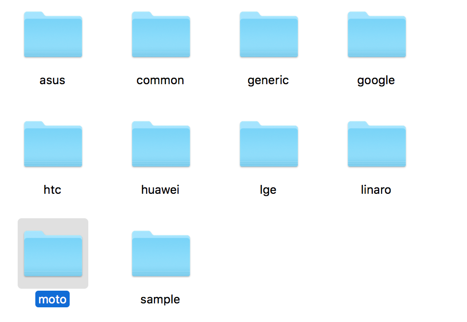

# AOSP 架構總覽

[上一章：使用adb工具開發AOSP](/ch5_adb)

本章節對`Android`架構做個簡介，同時介紹`AOSP`原始碼架構。

首先大家要有一個認識：Android是由許多跑在`Linux Kernel`上的`User Space Process`合作運行的。

## Android 架構

在進入`AOSP`資料夾的細節前，先讓我們了解Android整體的架構，看看裡面有哪些寶可以挖吧！

### Aplication Framework

這邊主要提供`Android Java`層和`C++`層的`API`。開發`App`時用的`class`和`function`就是由這裡提供的。要注意這裡包含了`C++`層－－事實上Android Framework主要是用`C++`寫的！

那為什麼我們是用`Java`寫Android　app呢？其實是因為Android Framework在啟動的最後階段準備了一個`JVM`，並在所有`C++`層的部份準備完成後切到`JVM`上，並執行Android Framework中`Java`的程式碼。這些`Java`程式碼會使用`JNI`來使用`C++`相關的`API`（包括公開給app使用的以及framework專用的）。而負責載入`app`的部份會用`JVM`來執行我們寫的`app`，所以`android app`才可以用`Java`寫。當然啦，如果想要的話其實你也可以用`C++`寫，不過工具和資源就不像`Java`這麼多。

另外其實這些`C++` framework`API`可以讓我們可以寫純`C++`程式，並在`AOSP`環境編譯。編譯出來的執行檔可以用`adb`放到你的裝置上執行。

### Binder IPC Proxies

負責處理`IPC(Inter Process Communication)`相關的機制。如果你用過`Handler`、`IBinder`或`Context.getSystemService(String)`等一些可以跨行程的`API`，就是由這裡集中處理的。Android的`IPC`機制通常也是研究`AOSP`的重點之一。

### Android System Service

Android系統提供的服務，像是`WindowManager`、`ActivityManager`、`TelephonyManager`、`PackageManager`及`PowerManager`等等，都是這層提供的服務。

### HAL

即`Hardware Abstract Layer`，直譯就是硬體抽象層，目的是為了讓driver可以不寫在`Linux Kernel`內，藉此避開`Linux Kernel`的`GPL`授權。HAL可以提供一些特別的feature給framework。各家晶片廠商會花不少心力在這上面。

### Linux Kernel

Kernel必需要先準備好，才行執行Android。負責和硬體溝通的driver會在這裡。另外值得一提的是Android用的`Linux Kernel`是特製的，像是`binder driver`就是`Linux Kernel`另外加入的部份。（之後再討論這部份）

## `$TOP/framework`

整個Android framework相關的程式碼全部都在裡面。從`C++`（`$TOP/framework/native`）到`Java`（`$TOP/framework/base`）的程式碼都在這裡面。基本上開發`AOSP`時我們大多都是在修改／研究這個資料夾。

## AOSP Source Code Overview

以下`$TOP`指AOSP的根目錄。

以開發`AOSP`來說，最主要看的程式碼會在：

* `$TOP/framework` - 整個Android framework最主要的程式碼
* `$TOP/external` - 編譯Android時需要的外部library
* `$TOP/hardware` - `HAL`層相關程式碼
* `$TOP/system` - 負責Android framework在啟動前要處理的事。Android的第一行程式碼在這裡面
* `$TOP/out` - 編譯`AOSP`後才會出現。所有編譯的暫用檔和結果都會在這個資料夾內。

## `$TOP/external`

`AOSP`有用到的外部libraries都會放在這邊。追source code比較深的話就會進來這裡看。

## `$TOP/hardware`

`HAL`層相關。`HAL`為`Hardware Abstract Layer`的縮寫。
各家廠商由於商業機密的關係，很多driver相關的程式碼是不願意公開的。而`AOSP`為了閃`Linux Kernel`的`GPL`授權，所以做了一個能在`user space`執行的driver架構。由於`HAL`相關的程式碼沒有要求也用`GPL`授權，所以各家廠商為`HAL`寫的程式碼就不用公開了。

## 其它重要的資料夾

簡單描述一下其它比較重要，但不在我們研究範圍內的資料夾

### `$TOP/build`

這邊放的是`AOSP`中編譯相關的工具

### `$TOP/bionic`

`AOSP`中不是用一般的C library，而是自己做了一個`bionic`

### `$TOP/device`

廠商自製的`AOSP`裝置的設定檔會放在這，可以在裡面看到 htc, huawei, moto...等廠商。理論上，公司新增的資料夾會在這裡，雖然 Android 並沒有強迫這麼做（Samsung 不在裡面）。

## 其它資料夾

### `$TOP/art` & `$TOP/dalvik`

兩者皆為Android的JVM

### `$TOP/cts`

`cts`測試相關

### `$TOP/development`

開發`AOSP`的工具集

### `$TOP/doc`

`AOSP`文件相關

### `$TOP/bootable`
`啟動`或是`引導`相關的Ｃ++語言程式碼，可以在 recovery 資料夾中看到， install.cpp 安裝, ui.cpp 顯示ＵＩ, adb_install.cpp adb安裝...。

### `$TOP/dalvik`
[dalvik虛擬機](https://zh.wikipedia.org/wiki/Dalvik%E8%99%9A%E6%8B%9F%E6%9C%BA)

Java字節碼（bytecode）被轉換成Dalvik虛擬機所使用的替代指令集。 一個未壓縮dex檔案通常稍小於一個已經壓縮的.jar檔。

### `$TOP/out`
編譯完後的程式碼會存在這個目錄裡面，不同平台編譯出來的產物會不太一樣。
### `$TOP/packages`
可以在裡面看到 

* App (應用程式) ：  
鬧鐘，電視，計算機，照相機...等各種ＡＰＰ。  
* inputmethods（輸入法）：  
LatinIME 拉丁文輸入法，OpenWnn 輸入法。  
* providers （提供器）：   
CalendarProvider聯絡人提供器，CalendarProvider 日曆提供器，DownloadProvider 下載提供器...  

### `$TOP/system`
使用Ｃ語言的比較底層的應用，例如：打開 Core 可以看到 fastboot 快速啟動相關, init 的原始碼, libcrypto_utils 加密相關，logcat log工具 ...

### `$TOP/tools`
工具
### `$TOP/sdk`
SDK 和模擬器

### `$TOP/pdk`

### `$TOP/platform_testing`

### `$TOP/prebuilts`

### `$TOP/toolchain`

### `$TOP/developers`

### `$TOP/kernel`

### `$TOP/libcore`

### `$TOP/libnativehelper`
TODO: 其它資料夾

## 完成！

到這邊相信你對`Android`的大架構及`AOSP`原始碼有了一定的了解，接下來讓我們設定`Android Studio`來開發`AOSP`吧。

[下一章：設定 Android Studio](/ch7_android_studio_setup)

## Reference

* [Android Interfaces and Architecture](https://source.android.com/devices/)
* [Android Core Technologies](https://source.android.com/devices/tech/index.html)
