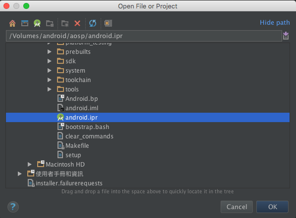
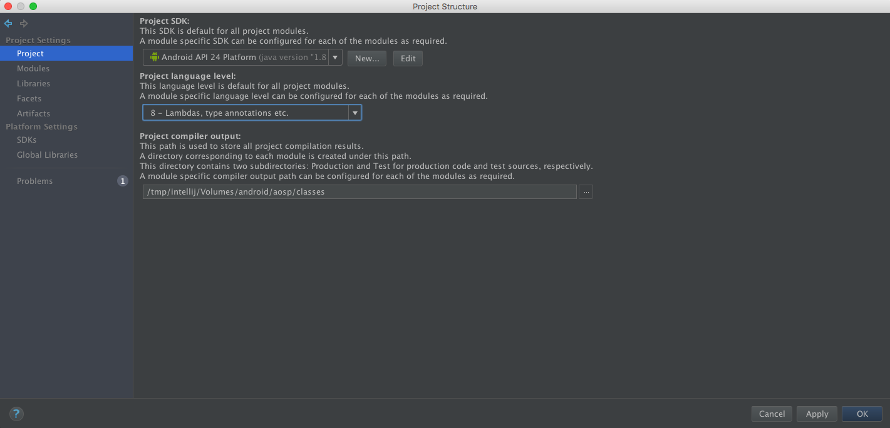
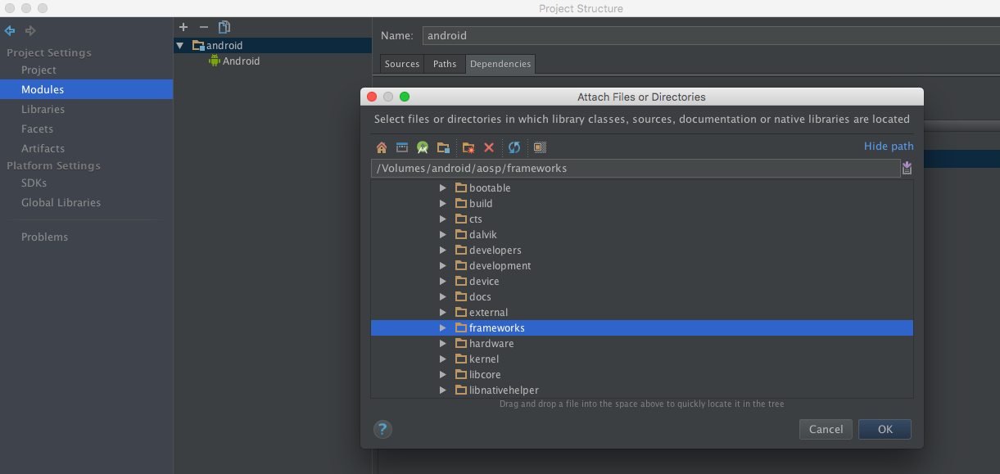
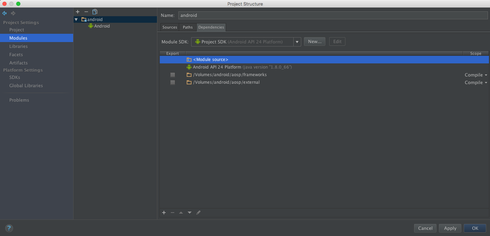
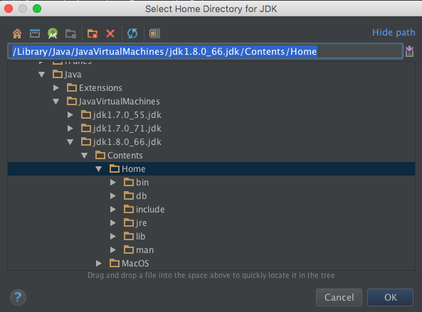
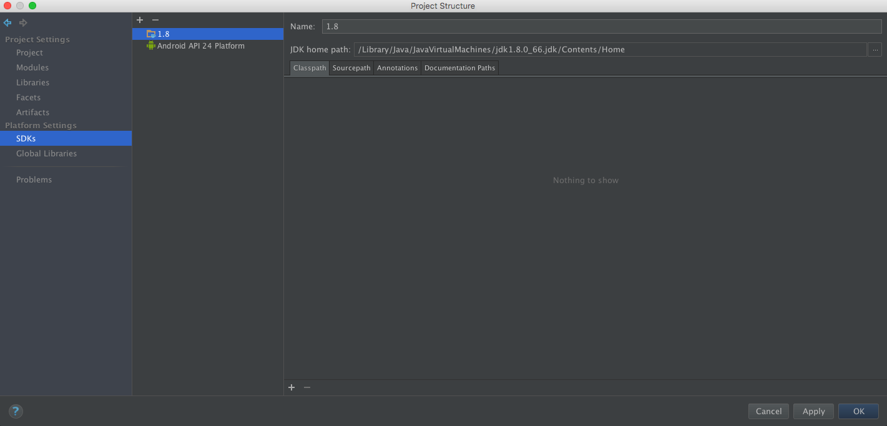
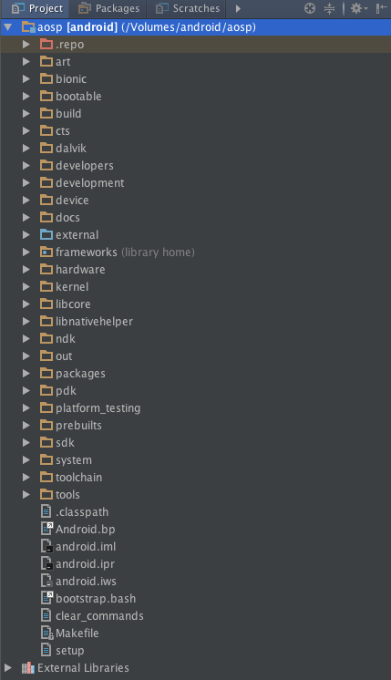

# 設定Android Studio

[上一章：AOSP架構總覽](/ch6_aosp_overview)

本章節將帶大家設置Android Studio環境，好讓我們可以用Android Studio來開發AOSP

如果你是硬派的vim或atom使用者，那麼可以跳本章節過:)

要注意的是，即使用了Android Studio，你還是會需要在終端機上下指令來編譯AOSP。畢竟Android Studio可不支援像是`mm`這種指令呀O_Q

或許你會問，那我還有必要設定Android Studio嗎？直接用像vim或atom之類的文字編輯器就行了吧？

基本上這點沒錯，但用Android Studio的好處是除了可以直接幫你自動補完程式碼，還可以讓你比較好Trace Code。另外就是讀書會社群的人比較多是App開發者出身，能用Android Studio來開發AOSP相信是比較舒服的！

## 產生Android Studio認識的index檔

設定好你的環境，前往`$TOP`資料夾，輸入

```shell
$ make idegen
$ development/tools/idegen/idegen.sh
```

`make idegen`會產生一個`idengen.jar`的檔案，執行結果如下

```shell
...
[ 25% 1/4] host Java: idegen (out/hos...BRARIES/idegen_intermediates/classes)
Note: Some input files use or override a deprecated API.
Note: Recompile with -Xlint:deprecation for details.
[100% 4/4] Install: out/host/darwin-x86/framework/idegen.jar

#### make completed successfully (59 seconds) ####
```

`idengen.jar`是一個能幫助我們產生IDE所需檔案的工具。而`development/tools/idegen/idegen.sh`會利用`idegen.jar`來產生Android Studio需要的`*.ipr`檔案

執行`development/tools/idegen/idegen.sh`約需要5分鐘，還請耐心等一下，完成後會出現

```shell
Read excludes: 27ms
   
Traversed tree: 204171ms

```

這樣就產生完Android Studio所需要的`*.ipr`檔案了，接著輸入`ls`或打開`finder`，你會在aosp原始碼目錄下看到`android.iml`和`android.ipr`兩個檔案。這就表示我們成功了

## 用Android Studio開啟AOSP專案

打開你的Android Studio，選`open project`，然後打開剛剛產生出來的`android.iml`檔案



打開後由於Android Studio要做indexing(建立檔案索引)的動作，因此第一次開會花很久……大概1-2個小時那麼久……

在AS一邊做indexing的期間我們可以先幫AOSP專案做一些trace code需要的設定

## 設定AOSP專案@Android Studio

在Android Studio內打開Project Setting，然後改成如下圖所示


### Project

選擇`API 24`和`Java8`



### Module

將Module設定全除了SDK外全部清空，然後加入`$TOP/framework`和`$TOP/external`。加入這兩個資料夾時會列出一大堆的檔案，請不要改變選項直接按OK。



完成後長這樣



### SDK

請留下`API 24`並加入一個新的`Java8 SDK`



完成後長這樣



## 選擇Project結構

由於AOSP本身不是App的專案結構，所以我們要改成資料夾顯示方式為Project。在你的Android Studio左上方的結構目錄處選擇Project就可以了。



## 完成！

等indexing結束後，到此為止就算是完成Android Studio的設定了！接下來就可以直接用Android Studio來看AOSP原始碼了喔！

## 參考資料

[如何使用Android Studio开发/调试Android源码(簡中))](http://www.cnblogs.com/Lefter/p/4176991.html)
